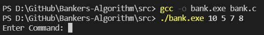
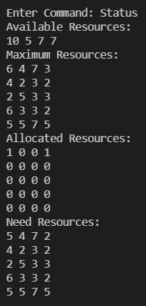
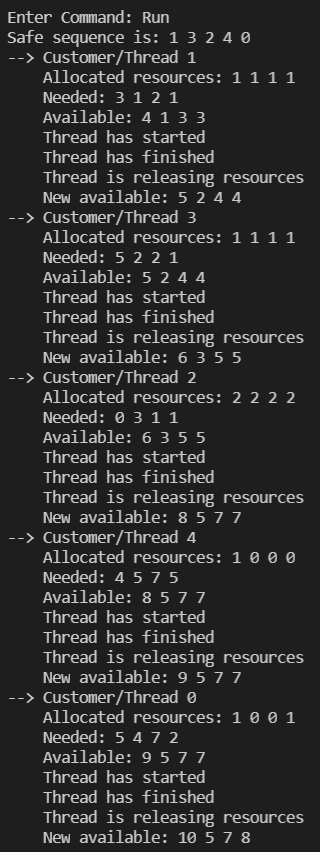
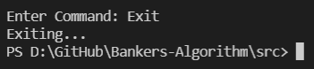

_<h1 align= "center">Bankers-Algorithm</h1>_

<h4 align= "center">CP386 Assignment 4</h4>

# Description

What is Bankers-Algorithm? (a Brief description of it)

# Installation

--> Programming Language:  
--> GCC Complier for C  
--> Windows Subsystem for Linux

Compile the program using GCC. When running, pass a list of space-delimited integers as arguments.
The value of the number represents the number of available resources of that type of resource.
Edit sample4_in.txt to change the threads/customers. Each line in the file represents a thread,
and the comma-delimited values represent the amount of each type of resource that the thread needs.

To compile and run:

# Features / Commands

- Request resources: 
   
   
   
- Release resources: 
   
   
   
- Status: 
   
   
- Run: 
   
   
- Exit: 
   
   

# Individual Contribution

### _Function-Wise_

| Function   | Kelvin | Nish |
| ---------- | ------ | ---- |
| Function 1 |        |      |
| Function 2 |        |      |
| Function 3 |        |      |
| Function 4 |        |      |
| Function 5 |        |      |
| Function 6 |        |      |
| Function 7 |        |      |
| Function 8 |        |      |

# Features

# Test cases

# Use Examples

# Contributors

--> [Kelvin Kellner](https://github.com/kelvinkellner) 
--> [Nishant Tewari](https://github.com/XSilviaX) 

# Credits

--> [GeeksforGeeks - Banker’s Algorithm in Operating System](https://www.geeksforgeeks.org/bankers-algorithm-in-operating-system-2/) 

# Project License

This project is licensed under the **MIT License** which is located [here](https://github.com/kelvinkellner/Bankers-Algorithm/blob/51cdac26b261e5d1328c41437b065f31d17f4da9/LICENSE)
